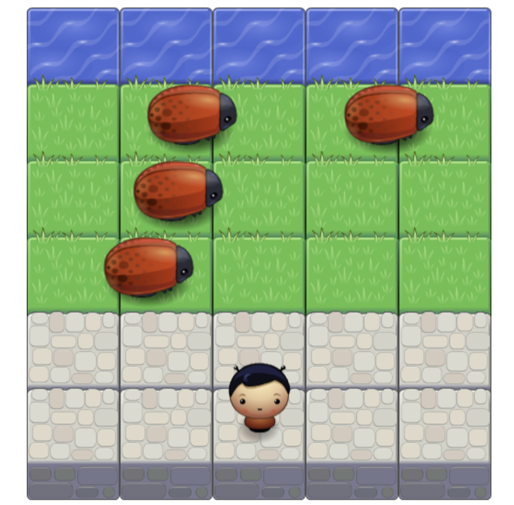

# Arcade Game Project

## Table of Contents

- [What is the Arcade Game](#What_is_the_Arcade_Game)
- [Challenge](#Challenge)
- [How to Play](#How_to_Play)
- [Instructions](#instructions)
- [How I built the Arcade Game](#How_I_built_the_Arcade_Game)
- [Contributing](#contributing)

## What is the Arcade Game

This is a simple game built to test a users speed.

## Challenge

Move the player to the river as fast as possible with the minimum effort.

## How to Play

Click the link below and load the game:
https://malhussaini.github.io/Arcade_Game/

## Instructions

- Use keyboard arrows to move.
- On your first move timer will start.
- Avoid hitting the bugs.
- Reach the river as fast as you can.

## How I built the Arcade Game

I manipulated the DOM with Vanilla JS, and also have altered part of the HTML and the style of the game. Game engin was provided to me.

- created the player class.
- Created multiple enemies to make the game more fun
- created a counter to count the number of moves made by player and timer to know the duration of a play.
- create a pop-up when player wins/lose the game.

#### Dependency

    Non

## Contributing

The majority of the project is taking from the udacity team repository.

This repository is encouraging and welcomes to _all_ contribution. If any, please make your pull request with clear name.

For details, check out [CONTRIBUTING.md](CONTRIBUTING.md).
